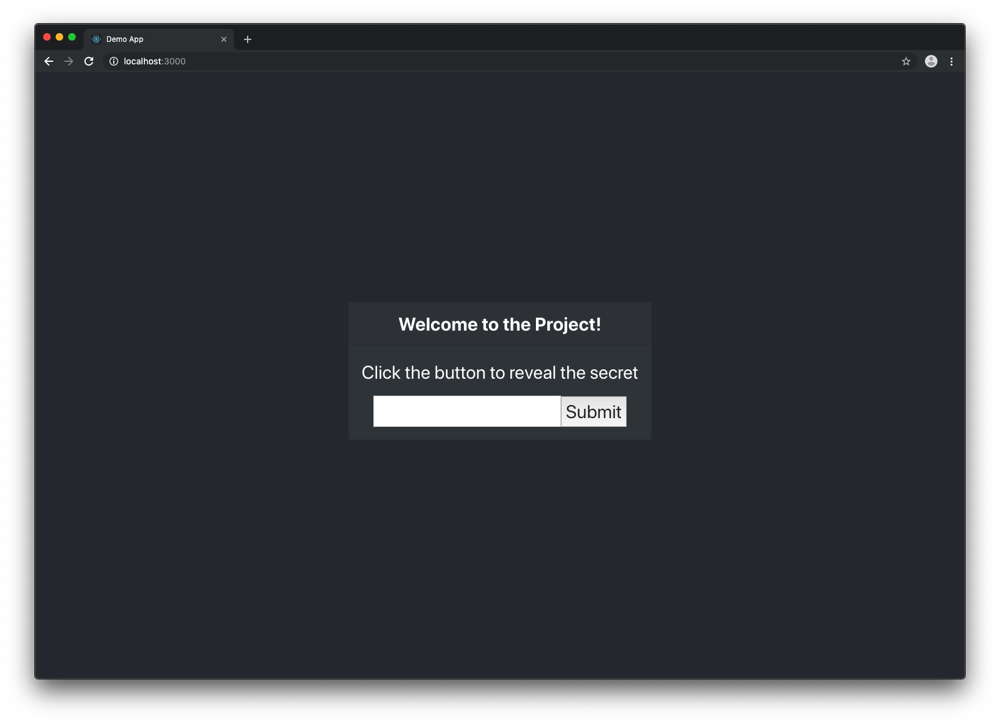
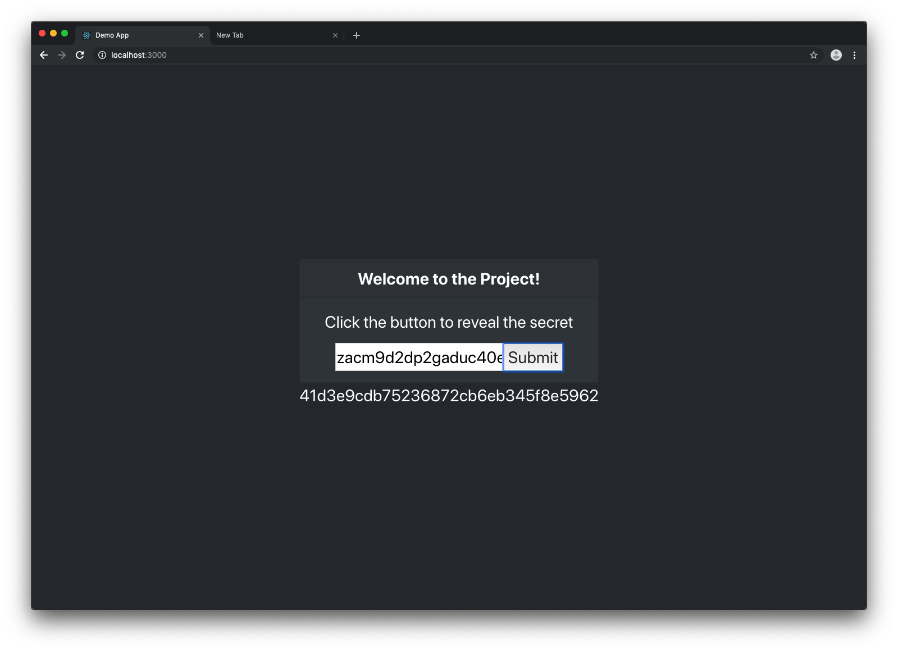

# Demo app for the Outreach DevOps Challenge




Welcome to the Demo application for the DevOps Challenge. This application
was built using React as the frontend and Django as the backend. Each service
is run in a Docker container and orchestrated by `docker-compose`.

Run the project:
```
docker-compose up
```
